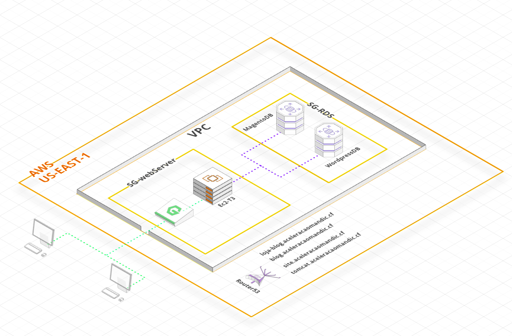

# Desafio 01
<div align="center"></div>
<div align="center">** Arquitetura AWS **</div>

## Requisitos Mínimos
- 1 Ec2-T3 Medium
- Centos 7
- 2 RDS - Tier/Test (Mysql 5.6)
- Domínio Registrado (SEU-DOMINIO.com)
- Inclusão do domínio Router53 
- Elastic Ip (Opcional)

### Ferramentas utilizadas
- Nginx 1.16
- Php 7.1
- Php-FPM 7.1
- Magento 2.2.2
- Compose 1.9
- WordPress 5.6
- Snap / Certbot
- Tomcat 9
- Vim


#### Etapa 1 - Configurar Repositório YUM
Na primeira etapa, instale todos os repositórios yum necessários em seu sistema, usados ​​no tutorial restante para várias instalações. Você está adicionando repositórios de servidor da comunidade REMI, EPEL, Webtatic e MySQL ao seu sistema.

```# yum install epel-release```
```# rpm -Uvh http://rpms.famillecollet.com/enterprise/remi-release-7.rpm```
 ```# rpm -Uvh http://repo.mysql.com/mysql-community-release-el7-5.noarch.rpm```

 #### Etapa 2 - Instalar o PHP 7
 Agora instale os pacotes do PHP 7 do repositório remi-php71 rpm usando o seguinte comando.

 ```# yum --enablerepo = remi-php71 install php```

 Agora instale os módulos php necessários. Use o seguinte comando para listar os módulos disponíveis nos repositórios yum.

 ```# yum --enablerepo = remi-php71 search php```

 Agora verifique todos os módulos listados no comando acima e instale os módulos necessários como abaixo.

 ```# yum --enablerepo = remi-php71 install php-mysql php-xml \ yum install php-mysql php-opcache php-xml php-mcrypt php-gd php-soap php-redis php-bcmath php-intl php-mbstring php-json php-iconv php-fpm php-zip```

 #### Etapa 3 - Instalar o NGINX
 NGINX é o servidor da web popular usado em sistemas Linux. Vamos instalar o servidor da web Nginx usando o seguinte comando em seu sistema.

 ```# yum install nginx```

 Agora inicie o serviço nginx e habilite para iniciar na inicialização usando os comandos abaixo.

 ```# systemctl enable nginx.service```
 ```# systemctl start nginx.service```

 ### Etapa 4 - Instalar PHP-FPM
Agora use o seguinte comando para instalar o pacote php7 fpm usando o seguinte comando.

 ```yum --enablerepo=remi-php71 install php-fpm```

 ### Etapa 5 - Criar Nginx VirtualHost
 Por fim, faça a configuração do Nginx VirtualHost. Para este exemplo, estamos editando o arquivo de configuração padrão.

 ```# vi /etc/nginx/conf.d/example.conf```

e faça as alterações conforme abaixo.
``` servidor { 
        escuta 80; 

        root / var / www; 
        index index.php index.html index.htm; 
        server_name example.com www.example.com; 

        localização / { 
                try_files $ uri $ uri / /index.html; 
        } 

        error_page 404 /404.html; 
        error_page 500 502 503 504 /50x.html; 
        localização = /50x.html { 
              root / usr / share / nginx / www; 
        } 

        localização ~ .php $ { 
                try_files $ uri = 404; 
                fastcgi_pass 127.0.0.1:9000; 
                fastcgi_index index.php; 
                fastcgi_param SCRIPT_FILENAME $ document_root $ fastcgi_script_name;
                incluem fastcgi_params; 
        } 
} 
```
Você deve fazer as mesmas alterações em todos os hosts virtuais configurados.

### Etapa 6 - Configurações adicionais
Realize as seguintes alterações
```
sudo vim /etc/php.ini
    cgi.fix_pathinfo
    memory_limit = 2048M ou 2G
    max_execution_time = 1800
    zlib.output_compression = On
    session.save_path = "/var/lib/php/session"

sudo vim /etc/php-fpm.d/www.conf
    listen = 127.0.0.1:9000
    listen.owner = nginx
    listen.group = nginx
    listen.mode = 0666

sudo mkdir -p /var/lib/php/session/
sudo chown -R nginx:nginx /var/lib/php/session/
sudo chmod -R 777 /var/lib/php/session/

sudo mkdir -p /run/php
sudo chown -R nginx:nginx /run/php/

```

### Etapa 7 - Reiniciar os serviços
```# systemctl restart nginx.service php-fpm.service ```

----
----
### Site estático em php
Sites estáticos são aqueles que são fixos e exibem o mesmo conteúdo para cada usuário, geralmente escritos exclusivamente em HTML. 

Crie um arquivo index.php no diretório rais de publicação:
~~~Bash
sudo vim /var/www/html/index.php
~~~
Cole e salve o seguinte conteúdo:
~~~php
<?php

// Mostra todas as informações, usa o padrão INFO_ALL
phpinfo();

// Mostra apenas informações dos módulos.
// phpinfo(8) mostra um resultado identico.
phpinfo(INFO_MODULES);

?>
~~~
Agora vamos denifir o acesso ao mesmo dentro de um Vhost:
~~~Bash
sudo vim /etc/nginx/conf.d/dite.conf
~~~
Cole o seguinte conteúdo
~~~Bash
server {
  server_name site.SEU-DOMINIO.com www.blog.SEU-DOMINIO.com;
  root /var/www/html;

  index index.php;

  location ~ .php$ {
        try_files $uri =404;
        fastcgi_pass 127.0.0.1:9000;
        fastcgi_index   index.php;
        fastcgi_param SCRIPT_FILENAME $document_root$fastcgi_script_name;
        include fastcgi_params;
    }
    location ~* .(js|css|png|jpg|jpeg|gif|ico|svg)$ {
        expires max;
        log_not_found off;
    }
}
~~~
-->  Agora devemos dar o restart no Nginx e php-fpm
~~~Bash
sudo systemctl restart nginx.service php-fpm.service 
~~~

----
----

### Instalação do Magento via Composer
Faça o download do "Composer" na página oficial do site https://getcomposer.org/download/ pegando a versão 1.9.0.

O instalador verificará algumas configurações do PHP e fará o download composer.phar para o seu diretório de trabalho. Este arquivo é o binário do Composer. É um PHAR (arquivo PHP), que é um formato de arquivo para PHP que pode ser executado na linha de comando, entre outras coisas.


Agora execute ```php composer.phar``` para executar o Composer.

Você pode instalar o Composer em um diretório específico usando a ```--install-dir``` opção e, adicionalmente, (re) nomeá-lo também usando a ```--filename``` opção. Ao executar o instalador, adicione os seguintes parâmetros:

```php composer-setup.php --install-dir=bin --filename=composer```

Agora execute ```php bin/composer``` para executar o Composer.


####Magento Pré-requisitos
    
- Instalar o Composer
- Obtenha [chaves de autenticação](https://devdocs.magento.com/guides/v2.3/install-gde/prereq/connect-auth.html) para o repositório de código Magento.


Primeiro crie o diretório onde vai ficar os publicado arquivos de instalação magento:
``` # mkdir -p /var/www/htm/magento ```

Vamos alterar o usuário e grupo para o nginx:
```# chown nginx.nginx -R /var/www/htm/magento```
```# chmod 775 -R /var/www/htm/magento```

Realizando a instalação via composer

```composer create-project --repository-url=https://repo.magento.com/ magento/project-community-edition=2.2.2 /var/www/html/magento/```

Agora vamos utilizar a **Public-key** como usuário e como Senha **Private-Key**. Lembrando que ambos foram geradas anteriormente dentro do marktplace do magento.


**Após a instalação do magento é necessário criar as tabelas dentro do banco de dados, para isso é primordial que você tenho o banco de dados já criado dentro do RDS**

Vamos digitar o seguinte comando no terminal, certifique-se de estar dentro do diretório magento onde foi publicado os arquivos pelo composer. Adicione as informações do seu banco de dados:

~~~Bash
bin/magento setup:install \
--db-host="IP or DNS" \
--db-name="Nome_BD" \
--db-user="Usuario_BD" \
--db-password="Senha_UserBD" \
--language="pt_BR" \
--currency="USD" \
--use-rewrites=1 \
--use-secure=0 \
--base-url="http://seu-dominio.com" \
--base-url-secure="https://seu-dominio.com" \
--admin-user=admin \
--admin-password=magentoadmin123 \
--admin-email=Seuemail \
--admin-firstname=admin \
--admin-lastname=user \
--cleanup-database
~~~

Depois de instalado é hora de criar o **VHOST** de acesso ao magento dentro do **NGINX** :

~~~Bash
sudo vim /etc/nginx/conf.d/magento.conf
~~~
Adicione o seguinte conteúdo:
```
upstream fastcgi_backend {
        #server  unix:/run/php/php-fpm.sock;
        server  127.0.0.1:9000;
}

server {
        server_name loja-blog.SEU-DOMINIO.com www.loja-blog.SEU-DOMINIO.com;
        set $MAGE_ROOT /var/www/html/magento;
        set $MAGE_MODE developer;
        include /var/www/html/magento/nginx.conf.sample;
}
```

Aplique a seguinte configuração no seu arquivo de configuração do *NGNIX*
~~~Bash
vim /etc/nginx/nginx.conf
~~~

```
# For more information on configuration, see:
#   * Official English Documentation: http://nginx.org/en/docs/
#   * Official Russian Documentation: http://nginx.org/ru/docs/
user nginx;
worker_processes auto;
error_log /var/log/nginx/error.log;
pid /run/nginx.pid;
# Load dynamic modules. See /usr/share/doc/nginx/README.dynamic.
include /usr/share/nginx/modules/*.conf;
events {
    worker_connections 1024;
}
http {
    log_format  main  '$remote_addr - $remote_user [$time_local] "$request" '
                      '$status $body_bytes_sent "$http_referer" '
                      '"$http_user_agent" "$http_x_forwarded_for"';
    access_log  /var/log/nginx/access.log  main;
    sendfile            on;
    tcp_nopush          on;
    tcp_nodelay         on;
    keepalive_timeout   65;
    types_hash_max_size 2048;
    include             /etc/nginx/mime.types;
    default_type        application/octet-stream;
    # Load modular configuration files from the /etc/nginx/conf.d directory.
    # See http://nginx.org/en/docs/ngx_core_module.html#include
    # for more information.
    include /etc/nginx/conf.d/*.conf;
    server {
        listen       80 default_server;
        listen       [::]:80 default_server;
        server_name  _;
        root         /usr/share/nginx/html;
        # Load configuration files for the default server block.
        include /etc/nginx/default.d/*.conf;
        location / {
        }
        error_page 404 /404.html;
            location = /40x.html {
        }
        error_page 500 502 503 504 /50x.html;
            location = /50x.html {
        }
    }
}
```

-->  Agora devemos dar o restart no Nginx e php-fpm
~~~Bash
sudo systemctl restart nginx.service php-fpm.service 
~~~

---
---

### Instalaçao do TOMCAT
O Tomcat é um servidor web Java, mais especificamente, um container de servlets. O Tomcat implementa, dentre outras de menor relevância, as tecnologias Java Servlet e JavaServer Pages e não é um container Enterprise JavaBeans. Desenvolvido pela Apache Software Foundation, é distribuído como software livre. 

#### Tomcat Pré-requisitos

- Privilégios [sudo](https://linuxize.com/post/create-a-sudo-user-on-centos/)
- Java SE 8 ou superior
- OpenJDK

Instalando o JAVA:
~~~Bash
sudo yum install java-1.8.0-openjdk-devel
~~~

#### Criar usuário do sistema Tomcat
Executar o Tomcat como usuário root é um risco de segurança e não é considerado uma prática recomendada.

Criaremos um novo usuário e grupo do sistema com diretório inicial /opt/tomcatque executará o serviço Tomcat:

~~~Bash
sudo useradd -m -U -d /opt/tomcat -s /bin/false tomcat
~~~

#### Baixe o Tomcat
Baixaremos a versão mais recente do Tomcat 9.0.x da [página de downloads](https://tomcat.apache.org/download-90.cgi) do Tomcat .

No momento em que este artigo foi escrito, era a versão mais recente do Tomcat 9.0.27. Antes de continuar com a próxima etapa, você deve verificar a página de download do Tomcat 9 para ver se uma versão mais recente está disponível.

Navegue até o ```/tmp``` diretório e faça download do arquivo zip Tomcat usando o seguinte comando wget :

~~~Bash
cd /tmp
wget https://www-eu.apache.org/dist/tomcat/tomcat-9/v9.0.27/bin/apache-tomcat-9.0.27.tar.gz
~~~
Quando o download for concluído, extraia o arquivo tar :
~~~Bash
tar -xf apache-tomcat-9.0.27.tar.gz
~~~
Mova os arquivos de origem do Tomcat para o ```/opt/tomcat``` diretório:
~~~Bash
sudo mv apache-tomcat-9.0.27 /opt/tomcat/
~~~

Tomcat 9 é atualizado com freqüência. Para ter mais controle sobre as versões e atualizações, criaremos um link simbólico chamado latest, que aponta para o diretório de instalação do Tomcat:
~~~Bash
sudo ln -s /opt/tomcat/apache-tomcat-9.0.27 /opt/tomcat/latest
~~~
O usuário do tomcat que configuramos anteriormente precisa ter acesso ao diretório de instalação do tomcat.

Execute o seguinte comando para alterar a propriedade do diretório para usuário e grupo tomcat:
~~~Bash
sudo chown -R tomcat: /opt/tomcat
~~~
Torne os scripts dentro do bindiretório executáveis, emitindo o seguinte chmodcomando:
~~~Bash
sudo sh -c 'chmod +x /opt/tomcat/latest/bin/*.sh'
~~~
### Crie um arquivo de unidade systemd
Para fazer o Tomcat funcionar como um serviço, abra seu editor de texto e crie um ```tomcat.service``` arquivo de unidade no ```/etc/systemd/system/```diretório:
~~~Bash
sudo vim /etc/systemd/system/tomcat.service
~~~
Cole o seguinte conteúdo:
~~~Bash
[Unit]
Description=Tomcat 9 servlet container
After=network.target

[Service]
Type=forking

User=tomcat
Group=tomcat

Environment="JAVA_HOME=/usr/lib/jvm/jre"
Environment="JAVA_OPTS=-Djava.security.egd=file:///dev/urandom"

Environment="CATALINA_BASE=/opt/tomcat/latest"
Environment="CATALINA_HOME=/opt/tomcat/latest"
Environment="CATALINA_PID=/opt/tomcat/latest/temp/tomcat.pid"
Environment="CATALINA_OPTS=-Xms512M -Xmx1024M -server -XX:+UseParallelGC"

ExecStart=/opt/tomcat/latest/bin/startup.sh
ExecStop=/opt/tomcat/latest/bin/shutdown.sh

[Install]
WantedBy=multi-user.target
~~~
Notifique o systemd que criamos um novo arquivo de unidade digitando:
~~~Bash
sudo systemctl daemon-reload
~~~
Habilite e inicie o serviço Tomcat:
~~~Bash
sudo systemctl enable tomcat
sudo systemctl start tomcat

sudo systemctl status tomcat
~~~

Agora vamos configurar um **VHOST** para o Tomcat. Vamos criar o arquivo com o seguinte comando:
~~~Bash
sudo vim /etv/nginx/conf.d/tomcat.conf
~~~
Cole o seguinte conteúdo:
~~~Bash
server {
        listen 80;
        listen [::]:80;
        server_name tomcat.SEU-DOMINIO.com;
   location / {
        proxy_set_header X-Forwarded-Host $host;
        proxy_set_header X-Forwarded-Server $host;
        proxy_set_header X-Forwarded-For $proxy_add_x_forwarded_for;
        proxy_pass http://127.0.0.1:8080/;
  }
}
~~~
-->  Agora devemos dar o restart no Nginx e php-fpm
~~~Bash
sudo systemctl restart nginx.service php-fpm.service 
~~~

----
----

### Instalação WORDPRESS
WordPress é um sistema livre e aberto de gestão de conteúdo para internet, baseado em PHP com banco de dados MySQL, executado em um servidor interpretador, voltado principalmente para a criação de páginas eletrônicas e blogs online. 

OBS: Tenha o banco de dados já criado com os devidos acessos em mãos.

#### Wordpress reuisitos mínimos
Versão do PHP 5.2.4 ou superior.
Versão do MySQL 5.0 ou superior.
Memória PHP Mínima 64MB

Vamos começar realizando o download TAR.GZ do wordpress da página oficial, lembrando que devemos estar dentro do diretório de publicação para facilitar:
~~~Bash
wget https://br.wordpress.org/latest-pt_BR.tar.gz
~~~

Em seguido iremos desempacotar nosso arquivo, ele irá extrair um diretório chamado wordpress este por sua vez deve ficar dentro do diretório raiz de publicação.
~~~Bash
sudo tar -xvf latest-pt_BR.tar.gz /var/www/html/
~~~

Aplique as devidas permissões no diretório  e troque o usuário e grupo para NGINX:
~~~Bash
sudo chown nginx.nginx -R /var/www/html/wordpress
sudo chmod 775 -R /var/www/html/wordpress
~~~

Agora vamos criar um **vhost** para acessarmos a interface de configuração do wordpress:

~~~Bash
vim /etc/nginx/conf.d/blog.conf
~~~
Cole o seguinte conteúdo:
~~~Bash
server {
 server_name blog.dkcorreria.tk;
    root /var/www/html/wordpress;
    index index.php;
    # log files
    access_log /var/log/nginx/blog.SEU-DOMINI.com.log;
    error_log /var/log/nginx/blog.SEU-DOMINI.com.error.log;
    location = /favicon.ico {
        log_not_found off;
        access_log off;
    }
    location = /robots.txt {
        allow all;
        log_not_found off;
        access_log off;
    }
    location / {
        try_files $uri $uri/ /index.php?$args;
    }
    location ~ .php$ {
        try_files $uri =404;
        fastcgi_pass 127.0.0.1:9000
        fastcgi_index   index.php;
        fastcgi_param SCRIPT_FILENAME $document_root$fastcgi_script_name;
        include fastcgi_params;
    }
    location ~* .(js|css|png|jpg|jpeg|gif|ico|svg)$ {
        expires max;
        log_not_found off;
    }
}
~~~
-->  Agora devemos dar o restart no Nginx e php-fpm
~~~Bash
sudo systemctl restart nginx.service php-fpm.service 
~~~
Agora é só acessar o seu domínio dentro de um navegador de sua preferência e prosseguir com a configuração do banco de dados.

---
---

### Configuração do certificado SSL
O Transport Layer Security, assim como o seu antecessor Secure Sockets Layer, é um protocolo de segurança projetado para fornecer segurança nas comunicações sobre uma rede de computadores.

Vamos utilizar o [CERTBOT](https://certbot.eff.org/)

Primeiramente vamos fazer a instalação de um novo gerenciador de pacotes
~~~Bash
sudo yum install -y snapd
~~~
Uma vez instalada, a unidade systemd que gerencia o soquete de comunicação snap principal precisa ser habilitada:
~~~Bash
sudo systemctl enable --now snapd.socket
~~~
Para ativar o suporte de snap clássico , digite o seguinte para criar um link simbólico entre /var/lib/snapd/snape /snap:
~~~Bash
sudo ln -s /var/lib/snapd/snap /snap
~~~

Validando versão do snap:
~~~Bash
sudo snap install core; sudo snap refresh core
~~~

Instalando certbot
~~~Bash
sudo snap install --classic certbot
~~~

Execute a seguinte instrução na linha de comando da máquina para garantir que o comando certbot possa ser executado
~~~Bash
sudo ln -s /snap/bin/certbot /usr/bin/certbot
~~~

Agora vamos executar o certbot e escolher quais domínios de nosso vhost gostariamos de adicionar o certificado. Ao escolhermos o domínio a inclusão do certificado ocorre de forma automatica incluido o restart do nginx. Para isso utilizamos o seguinte comando:
~~~Bash
sudo certbot --nginx
~~~