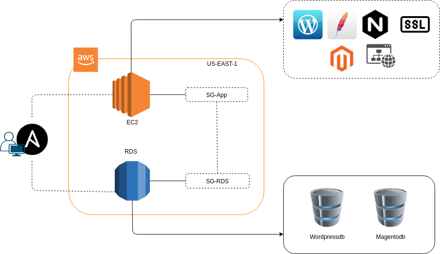

# Arquitetura do Projeto

---

## O que é Ansible?
Ansible é uma ferramenta de TI de código aberto para gerenciar, automatizar, configurar servidores e, implantar aplicativos, a partir de uma localização central. Ele inclui sua própria linguagem declarativa para descrever a configuração do sistema.

---

## Resumo do Projeto
Este projeto consiste em subir a infraestrutura em duas camadas, sendo servidor-web no frontend e Servidor Banco de dados no backend. Contendo algumas aplicações e serviços [Nginx, Wordpress, Magento, Tomcat, Site estático, Certibot] com todas as suas dependências.

## Requisitos
 1. Sistema operaciona Linux
 2. python3 / pip3
 3. Ansible 2.10
 4. Acesso programático a AWS/CLI
 5. Criar uma chave pem na AWS
  5.1.  Exportar variáveis de ambiente
    - export ANSIBLE_HOST_KEY_CHECKING=False
    - export AWS_ACCESS_KEY_ID
    - export AWS_SECRET_ACCESS_KEY
 6. Instalar modulos do ansible
     - ansible-galaxy collection install community.aws
     - ansible-galaxy collection install amazon.aws

<strong>Colaboradores:</strong>
  Diego Barcelos Comitre / Cristiamo Garcia Costa
